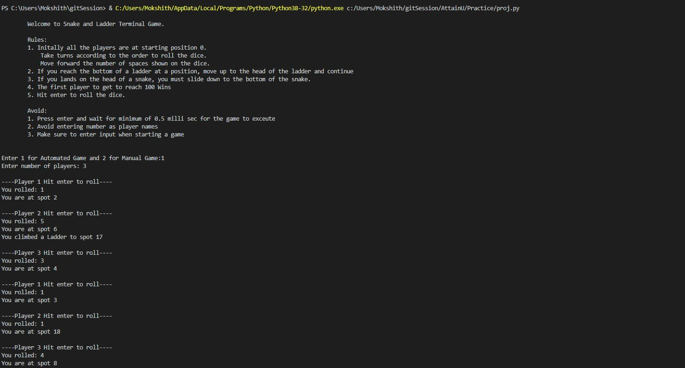

[](https://github.com/feross/standard)

  

# Snake and Ladder [](https://twitter.com/mokshith)

##### How is Snake and Ladder Played?

> Rules:
        1. Initally all the players are at starting position 0. 
            Take turns according to the order to roll the dice. 
            Move forward the number of spaces shown on the dice.
        2. If you reach the bottom of a ladder at a position, move up to the head of the ladder and continue
        3. If you land on the head of a snake, you must slide down to the bottom of the snake.
        4. The first player to get to reach 100 Wins
        5. Hit enter to roll the dice.

        Avoid:
        1. Press enter and wait for minimum of 0.5 milli sec for the game to exceute
        2. Avoid entering number as player names
        3. Make sure to enter input when starting a game

##### Snake and Ladder Dice Rules:

>	1. When a User throws a six, he is again prompted for a second chance
	2. If a User throws six repeatedly three times in a row,his/her chance will be void.


## Snake and Ladder PROJECT:

> #### This project consists mainly of three components:
	1. An Automated Approach
	2. A Manual Approach
	3. A Customizable Approach

	Automated Approach:In The automated game the user just needs to select how many players are playing the game and the system automatically calculates the player’s position and showcases which player has won the game.
	Manual Approach: In the manual game the user needs to enter the number of players playing the game and the name of the player. In this each action is executed on pressing the ENTER button. So if player wants to roll a dice he needs to press ENTER for the action to be performed.
	Customizable Approach:
		Features Added:
        	1. Increase the Board Size.
        	2. Adjust the Number of players that can play.
        	3. Update the snake and Ladder position according to your choice.
	  	4. Add the choice of your dice either 1 dice or 2 dice based on your needs.
 

## Difference between both approaches:
|         	Automated         				|         		Manual         				|
| :---------------------------------------------------------: 	| :------------------------------------------------------------:|
|1. Minimum number of players to play the game should be 2 	|1. Minimum number of players to play the game should be 2 	|
|2. No limit on maximum number of players that can play the game|2. Limit on maximum players, only 4 players can play at a time.|
	
# Installation Guide:

> step by step series of examples and explanations about how to get your development env running :)

##### Step 1

- Either Download the Repo,Which you will find at the top right of [Repo link](https://github.com/attainu/python-project-mokshith-sharma-au9.git) or clone it in your Local Machine.
  ```sh
  git clone https://github.com/attainu/python-project-mokshith-sharma-au9.git
  ```

##### Step 2

- Go into the Folder containing the Project Files
  ```sh
  cd Snake_and_Ladder_Project
  ```

##### Step 3

- Make Sure that your Machine has Python 3.6+
- Run the follwing Command
  ```python
  $ python3 Snake_and_Ladder_Code.py --help
  ```

##### Step 4

- Then,you will see the following:

  ```
	Welcome Message:
	Rules and Regulations

	Enter the option(in Numbers)
	1 for Automated Game 
	2 for Manual Game 
  ```

## Visual Guide for Command Line:

> Run the appropriate commands for the Target Applications,in the Terminal.

##Automated Approach
> 

##Manual Approach
> 

##Customizable Approach
> 


## Python Packages & Libraries Used

- time: To implement the command after a certain duration
- random: To randomly select a number
- sys: For System specific parameter and functions
- ast: For converting values to dictionary values

## Technologies Used:

- Python 3.8

## Future Scope:

- Build a GUI for this project
- Enable animation in dice roll
- Include sounds when the player moves, climbs ladder, or when he is hit by a snake.
- Create a score card and give option to user to play the game 1v1,vsCpu,group match etc.

## Contribute

Snake and Ladder is built on with Python 3.6. If you are new to this ,head over to this page
https://www.geeksforgeeks.org/snake-ladder-problem-2/

## Credits [](https://twitter.com/mokshith)

- Medium Articles
- Stackoverflow
- RealPython

## Licence

MIT © [V Mokshith Sharma]()
![][](https://github.com/mokshith-sharma-au9)
